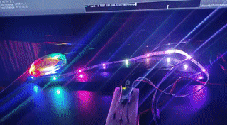
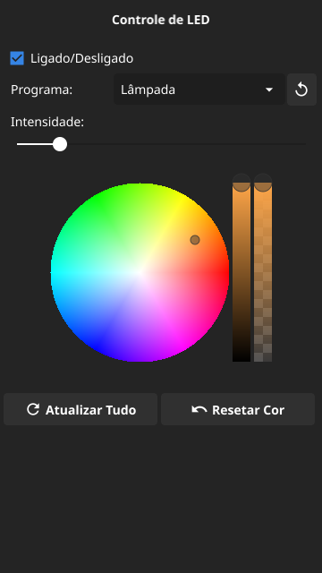

# LED Control

Iluminação IoT usando LEDs NeoPixel, controle remoto e mudança automática de iluminação.

A intenção original era criar um sistema simples de iluminação dinâmica para o meu quarto, usando IoT, e também permitir controlar isso remotamente (já que não tenho interruptor próximo à minha cama...), além de mudar automaticamente a iluminação em certos momentos do dia.

## Servidor no Raspberry Pi Pico W



Vamos usar o Raspberry Pi Pico W como um servidor HTTP 1.1 e também como um controlador para os LEDs NeoPixel. Esse dispositivo possui uma antena Wi-Fi, por isso ele é ideal para um servidor HTTP IoT.

### Circuito

Os requisitos mínimos para montar o projeto são:

- Uma protoboard ([uma de 400 pontos](https://www.makerhero.com/produto/protoboard-400-pontos/) é o suficiente);
- Um [Raspberry Pi Pico W](https://www.makerhero.com/produto/raspberry-pi-pico-w/) (deve ser este modelo, para que conectemos ao Wi-Fi -- lembre-se de soldar [pinos](https://www.makerhero.com/produto/barra-de-pinos-1x40-torneada-180-graus/) em ambas as extremidades para conectar à protoboard!);
- 7 [jumpers](https://www.makerhero.com/produto/kit-jumpers-10cm-x120-unidades/) macho-macho (para montar o circuito. Três desses jumpers são saídas para os LEDs, e podem ser substituídos por jumpers macho-fêmea a depender da extremidade usada);
- Uma [Fita de LED RGB WS2812 5050 de 1 metro](https://www.makerhero.com/produto/fita-de-led-rgb-ws2812-5050-1m/);
- Uma [chave táctil push-button](https://www.makerhero.com/produto/chave-tactil-push-button/).

A montagem pode ser feita de acordo com essa [esquemática](./img/breadboard.png).

### Instalação

O projeto encontra-se na pasta `rpi-pico-w`.

1. [Baixe a IDE Thonny](https://thonny.org/).
2. [Conecte seu Raspberry Pi Pico W e instale o MicroPython](https://projects.raspberrypi.org/en/projects/get-started-pico-w/1).
2. Vá ao menu `Ferramentas` > `Gerenciar pacotes`. Instale os pacotes `picozero` e `neopixel`.
3. Abra o arquivo `main.py`. Altere as variáveis `SSID` e `PASSWD` para as suas credenciais do seu Wi-Fi.
4. Você poderá executar a aplicação para testar nesse momento. Para fazer com que o MicroPython fique responsivo novamente, basta parar a aplicação.
5. Após testar, selecione a opção para salvar o script, e salve-o no seu Raspberry Pi Pico W, *exatamente com o nome `main.py`*.

Caso você tenha acesso à sua configuração do roteador, recomendo definir um IP estático para o Raspberry Pi Pico W.

### Comportamento e Rotas

Abaixo temos uma breve descrição dos comportamentos do servidor e das rotas que podem ser usadas.

**Todas as rotas retornam um documento JSON** com o seguinte formato:

```json
{
    "blinking": true,
    "program": 2,
    "dim": 0.1474,
    "color": "ffa648"
}
```

- `blinking`: Se os LEDs estão ligados ou não.
- `program`: Programa sendo executado. Os programas são sempre um dos números `0` (modo Natal), `1` (modo Rastro) e `2` (modo Lâmpada -- padrão).
- `dim`: Nível de intensidade da luz. Deve ser um número entre `0.02` e `1.0`.
- `color`: Cor atual dos LEDs (apenas para o modo Lâmpada). Trata-se de uma string com valores hexadecimais no formato `ffffff`.

Os valores de `program`, `dim` e `color` podem ser alterados e retornados normalmente, mesmo que o LED esteja desativado. Igualmente, o valor de `color` também pode ser alterado e retornado, mesmo que o equipamento não esteja no modo Lâmpada.

Caso você realize uma requisição em uma rota desconhecida, o servidor retornará um erro `404`.

#### Status do servidor

- `GET /led`

Retorna o status da aplicação, sem realizar nenhuma modificação.

#### Ligar/Desligar

- `POST /led/on`
- `POST /led/off`
- `POST /led/toggle`

Liga ou desliga os LEDs. Desligar os LEDs não desligará o servidor. A terceira rota inverte o estado atual de ligado/desligado.

#### Mudar programação

- `POST /led/program/{id}`
- `POST /led/change`

Muda a atual programação dos LEDs. A primeira rota coloca uma programação em específico, e a segunda muda para a próxima programação na ordem. O `id` dever corresponder ao número do programa, como descrito mais acima.

#### Mudar intensidade

- `POST /led/dim/{valor}`

Muda a intensidade da luz dos LEDs, em qualquer modo. O `valor` deve ser um valor entre `0.02` e `1.0`.

#### Mudar cor

- `POST /led/color/{hex}`

Define a cor dos LEDs, apenas para o modo Lâmpada. O `hex` deve ser uma cor em hexadecimal no formato `ffffff`.

## Controle Remoto



O controle remoto foi projetado para que seja possível controlar o servidor de LEDs remotamente, interagindo via requisições HTTP, especialmente pelo celular Android, mas também pode ser utilizado no desktop ou em outros sistemas. Ele funcionará normalmente caso você esteja conectado à mesma rede do seu Raspberry Pi Pico W.

### Testando a aplicação

Para compilar a aplicação, você precisa ter o compilador de Go 1.21.0 ou superior. Para compilar para o Android, instale Docker e a ferramenta [`fyne-cross`](https://github.com/fyne-io/fyne-cross).

Comece abrindo o arquivo `internal/wsclient/wsclient.go`. Altere a constante `BASEURL` para o IP fixo do seu Raspberry Pi Pico W.

Em seguida, para testar a aplicação, execute:

```bash
go run .
```

### Compilando para Android

Você poderá compilar sua aplicação para Android entrando na pasta `LEDControl` e executando o comando `make`, caso você tenha o GNU Makefile instalado. Caso contrário, use diretamente o `fyne-cross`:

```bash
fyne-cross android \
    -app-id com.luksamuk.ledcontrol \
    -icon Icon.png
```

*NOTA:* Para o Go 1.21.0, em 16/10/2023, a compilação com fyne-cross está quebrada.

## Serviço Web

Documentação em breve.

